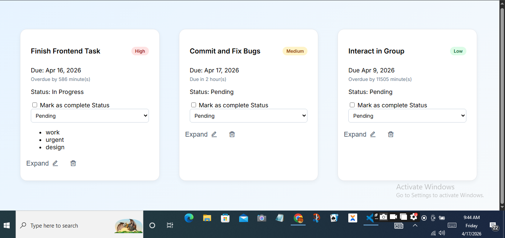
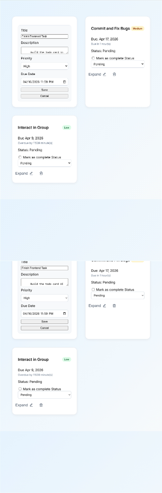
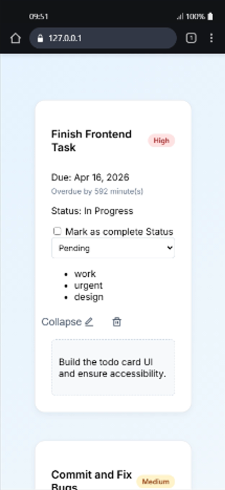

# 🚀 Advanced Todo Card — Stage 1A

## 📌 Overview

This project builds upon the Stage 0 Todo Card by introducing interactivity, state management, and improved accessibility.
Instead of a static UI, the card now behaves more like a mini application with editable content, dynamic time updates, and synchronized states.

---

## 🌐 Live Demo

👉 https://advanced-todocard.netlify.app


---

## 📸 Screenshots


### Desktop View


### Edit Mode


### Expanded State


---

## ✨ What Changed from Stage 0

### 1. Interactivity Added

* Users can now **edit task details** (title, description, priority, due date)
* Tasks support **status transitions**:

  * Pending
  * In Progress
  * Done

### 2. Stateful Behavior

* Checkbox, status text, and dropdown are now **fully synchronized**
* Task state persists visually (e.g., Done → strikethrough + muted UI)

### 3. Expand / Collapse Feature

* Task descriptions are now **collapsible**
* Toggle button allows users to reveal or hide details
* Controlled using `aria-expanded` for accessibility

### 4. Time Management Improvements

* Dynamic time updates every 60 seconds
* Displays:

  * “Due in X days/hours/minutes”
  * “Overdue by X time”
* Stops updating when task is marked as **Done**
* Replaced with “Completed”

### 5. Priority Indicators

* Visual priority system added:

  * High → red accent
  * Medium → yellow accent
  * Low → green accent

---

## 🎨 New Design Decisions

### 1. Single Source of Truth for Description

* Description is now placed **inside the collapsible section**
* Prevents duplication and ensures edit mode updates the correct content

### 2. Modular JavaScript Architecture

* Features are separated into independent modules:

  * Base setup
  * Status sync
  * Edit mode
  * Expand/collapse
  * Time logic
  * Delete functionality
* Improves maintainability and debugging

### 3. Responsive Layout with CSS Grid

* Mobile → 1 column
* Tablet → 2 columns
* Desktop → 3 columns
* Ensures consistent spacing and avoids layout breakage

### 4. Improved Visual Feedback

* Hover animations on cards
* Smooth transitions for UI interactions
* Clear visual states:

  * Done → muted + strikethrough
  * Overdue → red indicator
  * High priority → strong highlight

---

## ⚠️ Known Limitations

* No persistent storage:

  * Changes reset on page refresh
* Expand/collapse hides full description by default:

  * No preview snippet yet
* Time updates rely on browser runtime (no background sync)
* No drag-and-drop or multi-card state management (single-card focus per requirement)

---

## ♿ Accessibility Notes

* All form inputs include proper `<label>` associations
* Expand/collapse button uses:

  * `aria-expanded`
* Live time updates use:

  * `aria-live="polite"`
* Interactive elements are keyboard accessible:

  * Tab navigation follows logical order
* Focus styles are visible for all controls
* Status control has accessible naming via labels

---

## 📱 Responsiveness

* Fully responsive across:

  * 320px (mobile)
  * 768px (tablet)
  * 1024px+ (desktop)
* Edit forms stack vertically on smaller screens
* Layout remains stable with:

  * Long titles
  * Long descriptions
  * Multiple tags

---

## 🛠️ How to Run Locally

1. Clone the repository:

   ```bash
   git clone https://github.com/Cryptodoll-sketch/advanced-todo-card.git
   ```

2. Navigate into the project folder:

   ```bash
   cd advanced-todo-card
   ```

3. Open `index.html` in your browser:

   * Double click OR
   * Use Live Server (recommended in VS Code)

---


## 👤 Author

**Olamide Tobun**

---

## 💡 Final Notes

This stage focuses on building a **single advanced, interactive Todo Card**, not a full application.
The architecture is intentionally designed to be scalable for future stages.

---
